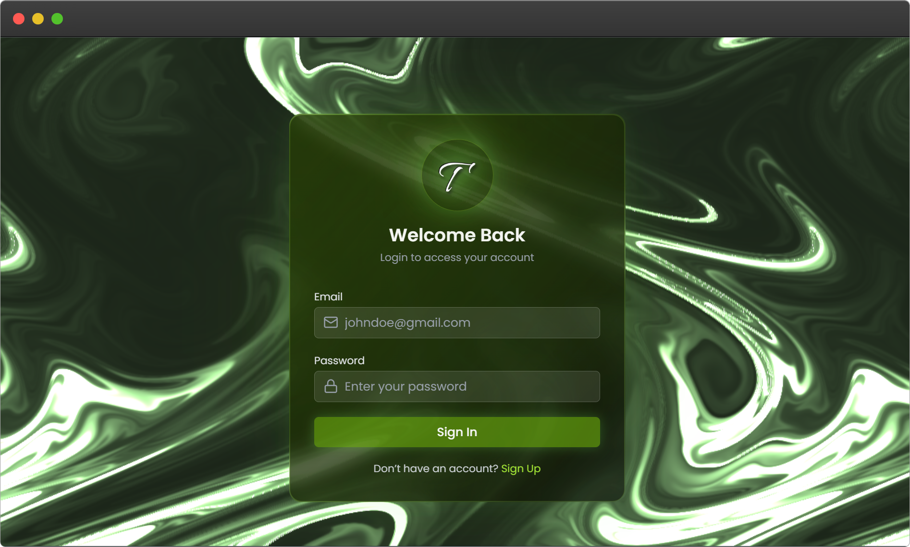
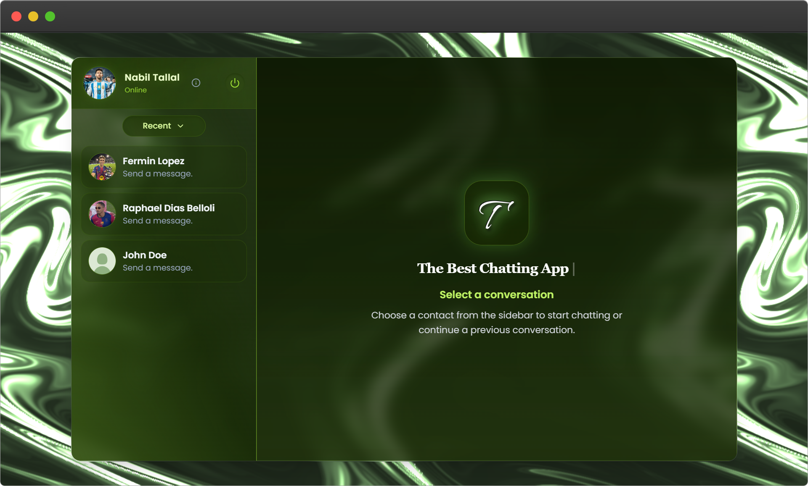
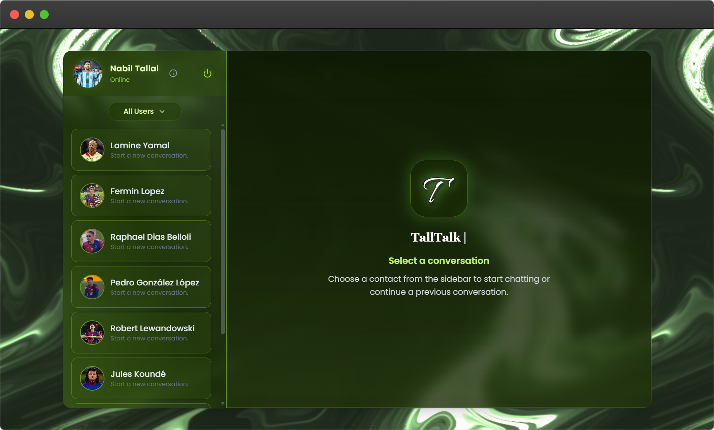
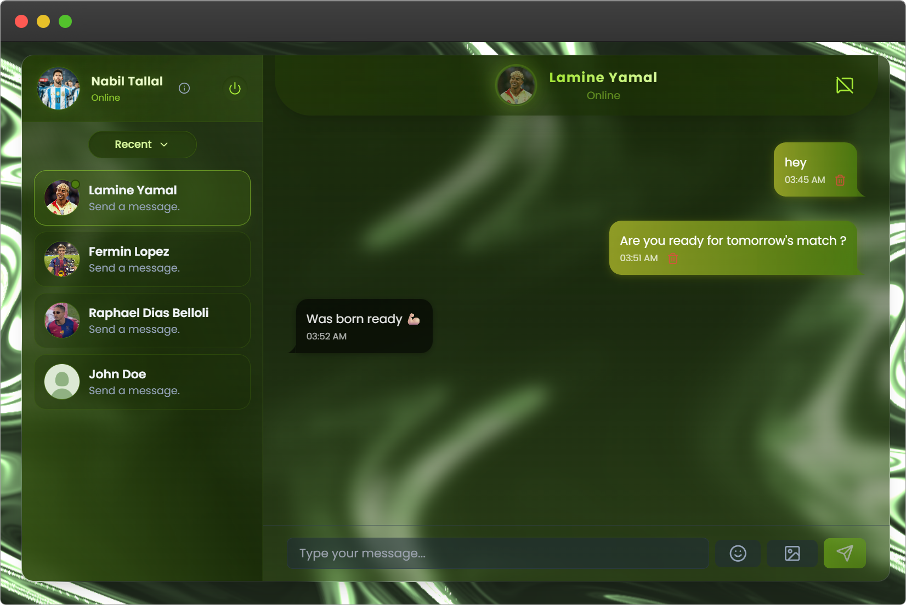
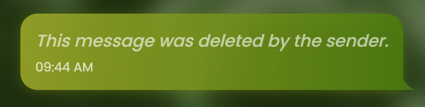
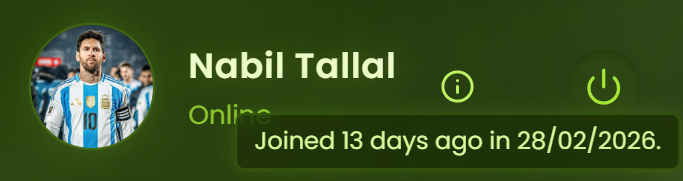

<div align="center">


# TallTalk
### A Modern, Secure, Real-Time Chat Application


*Developed as a Bachelor's Thesis - University of Debrecen, Faculty of Informatics*

</div>

---

## 📋 Table of Contents

- [Overview](#-overview)
- [Features](#-features)
- [Tech Stack](#️-tech-stack)
- [Project Structure](#-project-structure)
- [Installation & Setup](#-installation--setup)
- [API Endpoints](#-api-endpoints)
- [Security Architecture](#-security-architecture-tallsec)
- [Testing](#-testing)
- [Screenshots](#-screenshots)
- [Future Improvements](#-future-improvements)
- [Author](#-author)
- [Acknowledgements](#-acknowledgements)
- [License](#-license)

---

## 🌐 Overview

**TallTalk** is a full-stack, real-time one-to-one chat application built on the **MERN stack** (MongoDB, Express.js, React, Node.js) with **Socket.IO** powering live communication. It delivers a smooth, secure, and responsive messaging experience with a strong emphasis on security throughout the entire architecture.

> Developed as part of a Computer Science BSc thesis at the **University of Debrecen**, this project explores modern full-stack development patterns, WebSocket-based real-time systems, and a custom multi-layered security model called **TallSec**.

---

## ✨ Features

### 💬 Core Functionality

| Feature | Description |
|---|---|
| 🔐 **Secure Authentication** | JWT-based auth with HTTP-only cookies |
| 💬 **Real-Time Messaging** | Instant delivery via Socket.IO |
| 👤 **User Profiles** | Profile pictures hosted securely on Cloudinary |
| 🟢 **Online Status** | Live online/offline presence indicators |
| 🖼️ **Image Sharing** | Send and receive images within conversations |
| 📜 **Chat History** | Fully persistent message storage via MongoDB |
| 📧 **Welcome Emails** | Automated onboarding emails via Resend |
| 📱 **Responsive Design** | Seamless experience across all screen sizes |

### 🛡️ Security Features (TallSec)

| Protection | Implementation |
|---|---|
| Authentication | JWT + HTTP-only cookies |
| Password Security | `bcrypt` hashing |
| API Protection | Route protection middleware |
| Real-time Security | WebSocket authentication |
| Abuse Prevention | Rate limiting (100 req / IP / min) |
| Client Hardening | Helmet headers (CSP, XSS protection) |
| Bot Mitigation | User-agent filtering |
| Input Safety | Field validation & sanitization |
| Media Security | Secure Cloudinary integration |

---

## 🏗️ Tech Stack

| Layer | Technology |
|---|---|
| **Frontend** | React, Vite, Zustand, Axios, Tailwind CSS, DaisyUI, react-hot-toast |
| **Backend** | Node.js, Express.js, MongoDB, Mongoose, Socket.IO, JWT, bcrypt |
| **Security** | Helmet, custom rate limiter, bot detection |
| **Media** | Cloudinary |
| **Email** | Resend |
| **Deployment** | Render *(or any Node.js-compatible host)* |

---

## 📁 Project Structure
```text
TallTalk/
├── frontend/                    # React client application
│   ├── src/
│   │   ├── components/          # Reusable React components
│   │   ├── stores/              # Zustand global state stores
│   │   ├── services/            # Axios API service layer
│   │   └── utils/               # Utility / helper functions
│   └── package.json
│
├── backend/                     # Node.js server application
│   ├── controllers/             # Route handler logic
│   ├── models/                  # Mongoose data schemas
│   ├── routes/                  # Express API route definitions
│   ├── middleware/              # Auth & security middleware
│   ├── utils/                   # JWT, Cloudinary helpers
│   ├── email/                   # Email templates & dispatch
│   └── package.json
│
└── README.md
```

---

## 🚀 Installation & Setup

### ✅ Prerequisites

- **Node.js** `v18+`
- **MongoDB** - local instance or [MongoDB Atlas](https://www.mongodb.com/atlas)
- **Cloudinary** account - [cloudinary.com](https://cloudinary.com)
- **Resend** account - [resend.com](https://resend.com)

---

### 1. Clone the Repository
```bash
git clone https://github.com/yourusername/talltalk.git
cd talltalk
```

---

### 2. Backend Setup
```bash
cd backend
npm install
```

Create a `.env` file inside `backend/`:
```env
PORT=5000
MONGO_URI=your_mongodb_connection_string
JWT_SECRET=your_jwt_secret_key
CLOUDINARY_CLOUD_NAME=your_cloudinary_name
CLOUDINARY_API_KEY=your_cloudinary_api_key
CLOUDINARY_API_SECRET=your_cloudinary_api_secret
RESEND_API_KEY=your_resend_api_key
FRONTEND_URL=http://localhost:5173
NODE_ENV=development
```

> ⚠️ Never commit your `.env` file. Add it to `.gitignore`.

Start the development server:
```bash
npm run dev
```

---

### 3. Frontend Setup
```bash
cd ../frontend
npm install
```

Create a `.env` file inside `frontend/`:
```env
VITE_API_URL=http://localhost:5000/api
VITE_SOCKET_URL=http://localhost:5000
```

Start the development server:
```bash
npm run dev
```

---

### 4. Open the App
```
http://localhost:5173
```

---

## 🔧 API Endpoints

### 🔑 Authentication - `/api/auth`

| Method | Endpoint | Auth Required | Description |
|---|---|---|---|
| `POST` | `/signup` | ❌ | Register a new user |
| `POST` | `/login` | ❌ | Authenticate and receive JWT cookie |
| `POST` | `/logout` | ✅ | Logout and clear session cookie |
| `PUT` | `/profile-update` | ✅ | Update profile picture |
| `GET` | `/check` | ✅ | Verify active user session |

### 💬 Messages - `/api/messages`

| Method | Endpoint | Auth Required | Description |
|---|---|---|---|
| `GET` | `/contacts` | ✅ | List all users except current |
| `GET` | `/chats` | ✅ | List users with existing conversations |
| `GET` | `/users/:userId/messages` | ✅ | Fetch message history with a user |
| `POST` | `/users/send/:userId/messages` | ✅ | Send a message to a user |
| `PUT` | `/:messageId/deleteForAll` | ✅ | Delete a message for all parties |

---

## 🔒 Security Architecture (TallSec)

**TallSec** is a custom, defense-in-depth security model built into TallTalk's core. Rather than relying on a single protection mechanism, it layers multiple safeguards across every part of the stack:
```
┌─────────────────────────────────────────────┐
│                   CLIENT                    │
│         Helmet Headers · XSS Protection     │
├─────────────────────────────────────────────┤
│                 API GATEWAY                 │
│     Rate Limiting · Bot Detection · CORS    │
├─────────────────────────────────────────────┤
│               AUTHENTICATION                │
│         JWT · HTTP-only Cookies             │
├─────────────────────────────────────────────┤
│              ROUTE PROTECTION               │
│    Middleware Auth Guards · Input Validation│
├─────────────────────────────────────────────┤
│            WEBSOCKET LAYER                  │
│         Socket.IO Auth Handshake            │
├─────────────────────────────────────────────┤
│                 DATABASE                    │
│       bcrypt Hashing · Schema Validation    │
└─────────────────────────────────────────────┘
```

---

## 🧪 Testing

### Backend - Postman

All REST endpoints were systematically tested in **Postman**, covering:

- ✅ User registration and login flows
- ✅ Protected route enforcement
- ✅ Message sending and retrieval
- ✅ Rate limiting (`429 Too Many Requests`)
- ✅ JWT tampering and invalid token handling
- ✅ Security header verification

### Frontend

- ✅ Unit tests for Zustand state stores
- ✅ Integration tests for full message flow
- ✅ Manual cross-browser UI testing

---

## 📸 Screenshots

| Screen | Preview |
|---|---|
| Signup Page |  |
| Login Page |  |
| No Chat Selected |  |
| No Chat Selected (All) |  |
| Conversation Selected |  |
| Message Deleted |  |
| Account Creation |  |

> 📸 All screenshots available in the [`screenshots/`](./screenshots/) folder.
---

## 🚧 Future Improvements

- [ ] End-to-end message encryption
- [ ] Typing indicators
- [ ] Video and audio sharing
- [ ] Group chat support
- [ ] Message read receipts
- [ ] Push notifications
- [ ] Database indexing & caching layer
- [ ] CI/CD pipeline integration
- [ ] Native mobile application

---

## 👨‍💻 Author

<div align="center">

**Nabil Tallal**  
Computer Science BSc  
University of Debrecen, Faculty of Informatics

</div>

---

## 🙏 Acknowledgements

- **Dr. Adamkó Attila Tamás** - Thesis supervisor
- **University of Debrecen**, Faculty of Informatics
- The open-source community for the incredible tools and libraries that made this possible

---

## 📄 License

This project was developed as an academic thesis at the University of Debrecen. For usage, reproduction, or collaboration inquiries, please contact the author directly.

---

<div align="center">

*TallTalk - Modern, Secure, Real-Time Communication*

</div>
